## 计算机毕业设计Python+LSTM预测模型股票分析预测 股票量化分析与预测系统 股票可视化 股票大数据 股票爬虫 Tensorflow PyTorch 深度学习 机器学习

## 要求
### 源码有偿！一套(论文 PPT 源码+sql脚本+教程)

### 
### 加好友前帮忙start一下，并备注github有偿纯python股票预测25

### 我的QQ号是2827724252或者798059319或者 1679232425或者微信:bysj2023nb 或bysj1688

# 

### 加qq好友说明（被部分 网友整得心力交瘁）：
    1.加好友务必按照格式备注
    2.避免浪费各自的时间！
    3.当“客服”不容易，repo 主是体面人，不爆粗，性格好，文明人。
## 介绍

### 本项目利用 Python 网络爬虫技术从某财经网站实时采集A股各大指数、个股的 K线数据、公司简介、财务指标、机构预测、资金流向、龙虎榜等数据，并进行 KDJ、BOLL等技术指标的计算和收益率的量化计算，构建股票数据分析与预测系统，深入挖掘板块热点、资金流向、市场估值等，并利用 Tensorflow 深度学习框架构建 LSTM 神经网络，预测个股的未来走势。
### 通过该系统，用户可以更加科学地进行股票投资决策，提高投资回报率。通过不断优化算法模型与用户体验，未来有望将此系统推广至更广泛的场景中，为股票市场的量化分析与预测提供有力支持。
### 数据获取是股票数据分析的第一步，找不到可靠、真实的数据，量化分析就无从谈起。随着信息技术的不断发展，数据获取渠道也越来越多，当前包括开源的股票数据获取的工具：tushare、baostock、pandas_datareader和yahool等财经数据API，这样可以节省不少精力。当这些开源的API接口不能满足自己特定场景的股票数据需求的时候，本项目利用 Python 编写网络爬虫采集某财经网站的行情数据。采集的数据包括：
1、指数或个股的模糊搜索；
2、获取个股的 K 线和基本指标数据;
3、个股基本面信息获取；
4、个股的最新核心题材；
5、A股的资金流的最新排名；
6、个股主力资金占比排名；
7、交易日的涨停板数据；
8、沪深两市实时资金流;
9、获取南向实时资金流;
10、获取市场的市盈率和市净率的估值数据
11、A 股的所有股票最新排名榜单
12、......

## 演示视频

https://www.bilibili.com/video/BV1fsmgYpEXi/?spm_id_from=333.999.0.0

## 演示截图

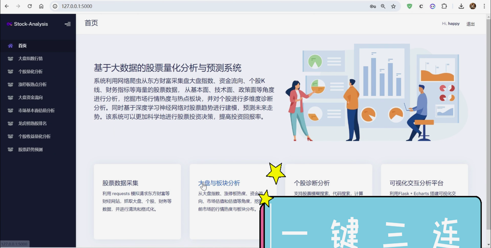
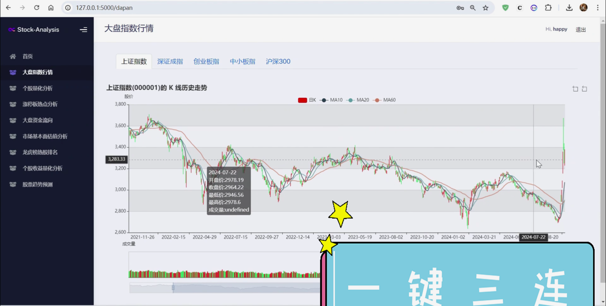
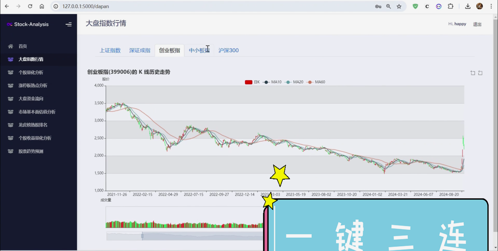
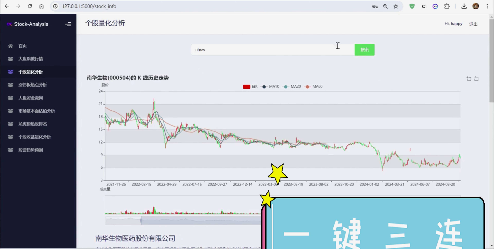
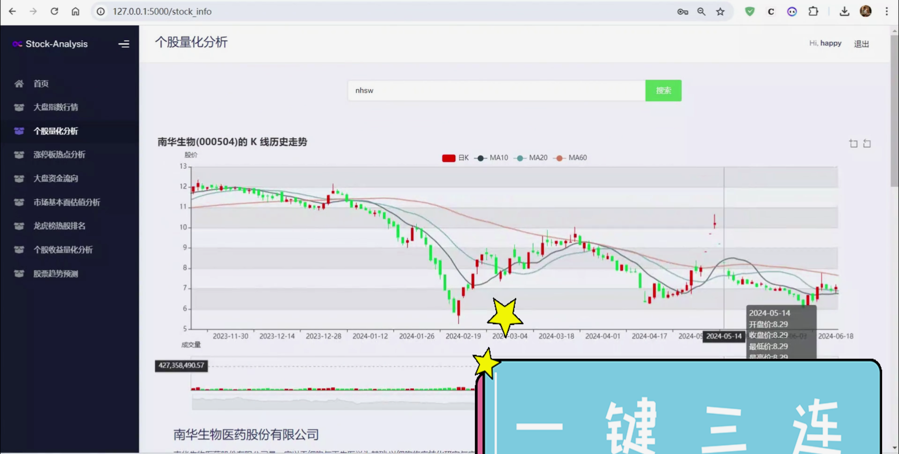
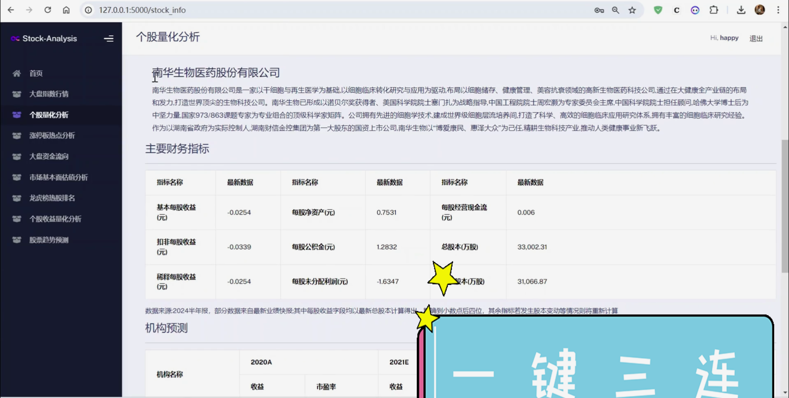
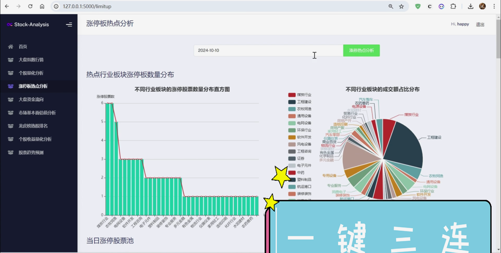
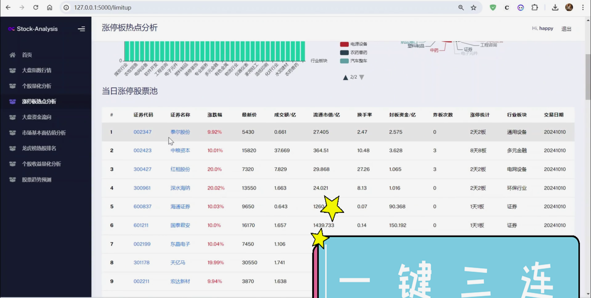
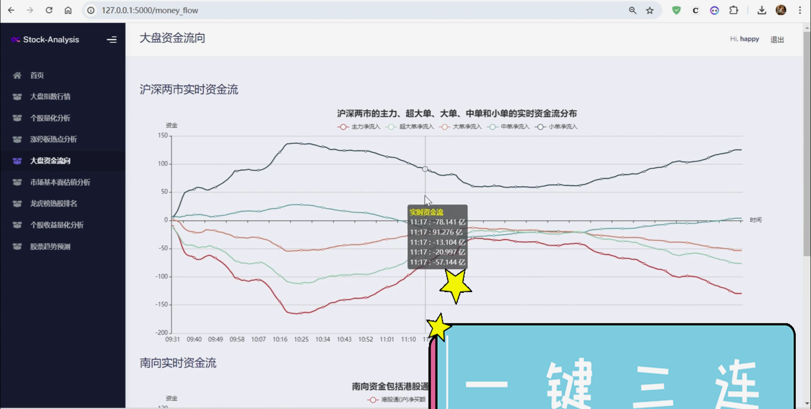
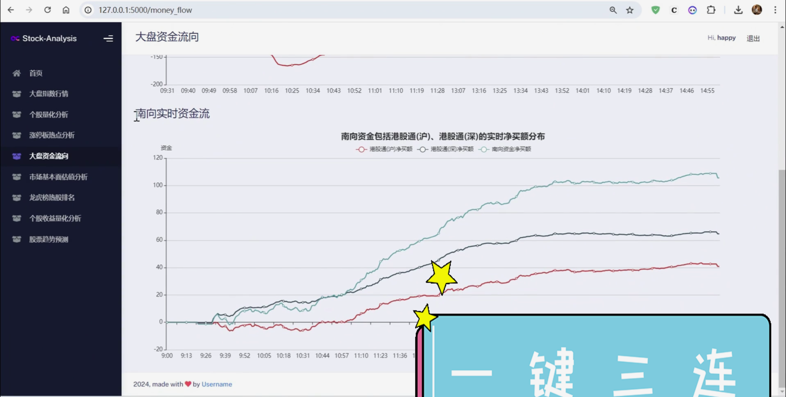
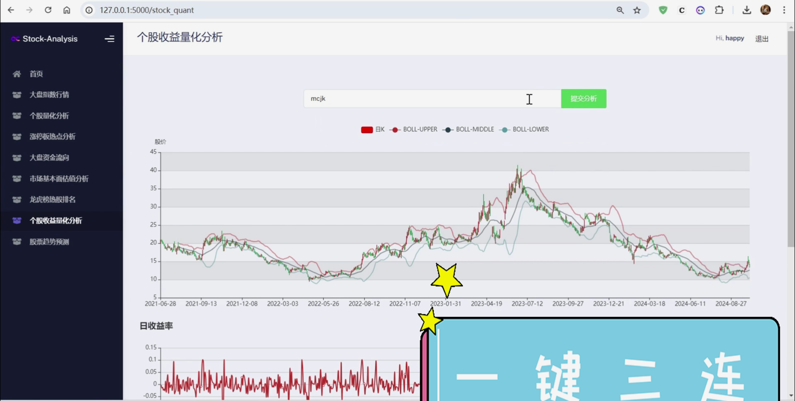
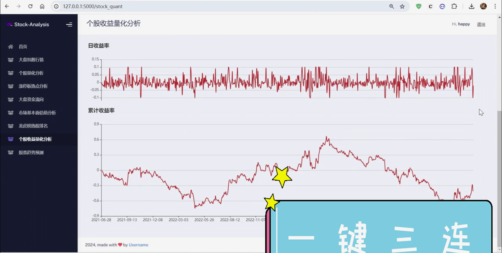
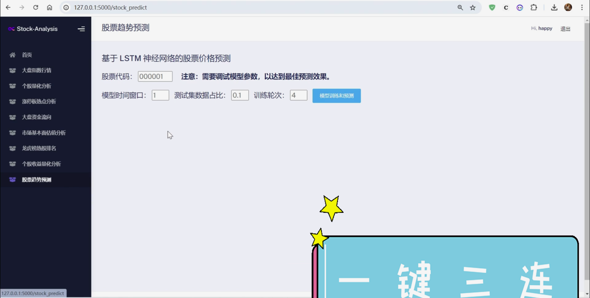
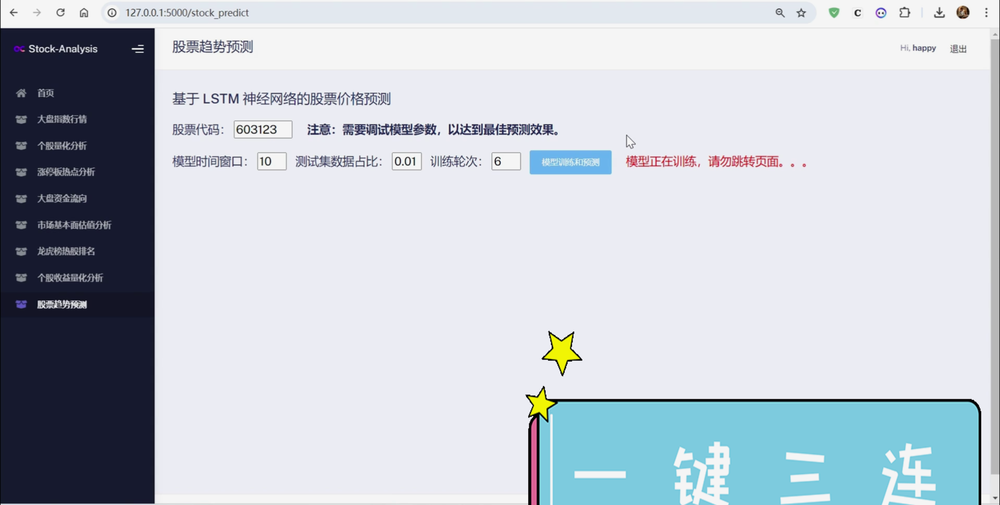
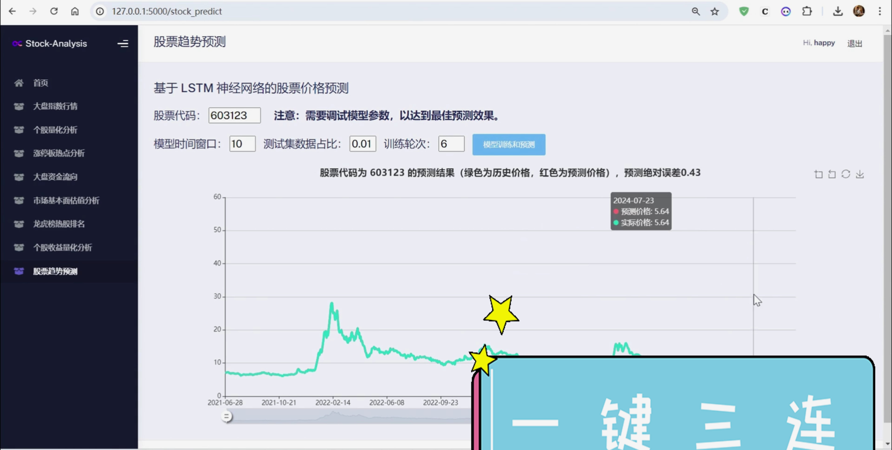
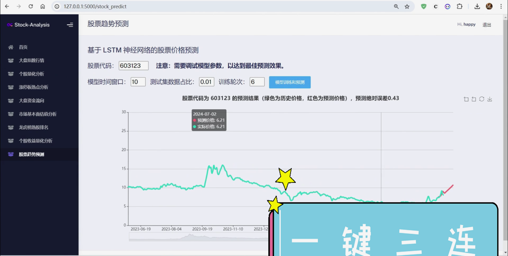
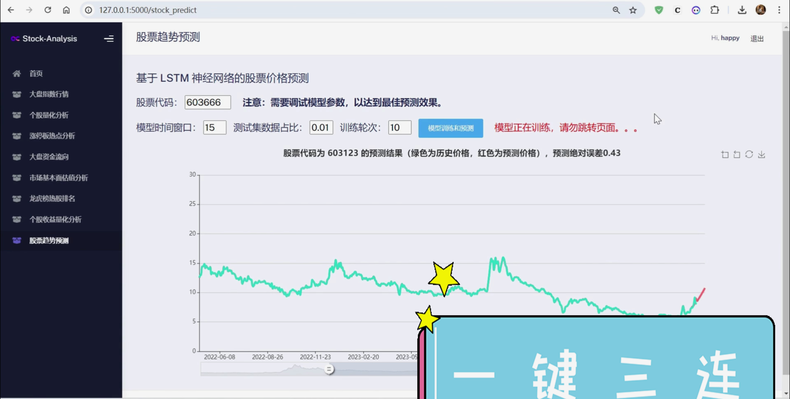
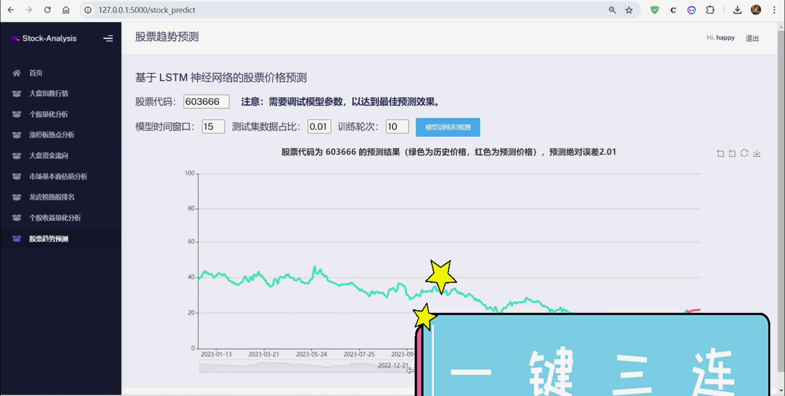

